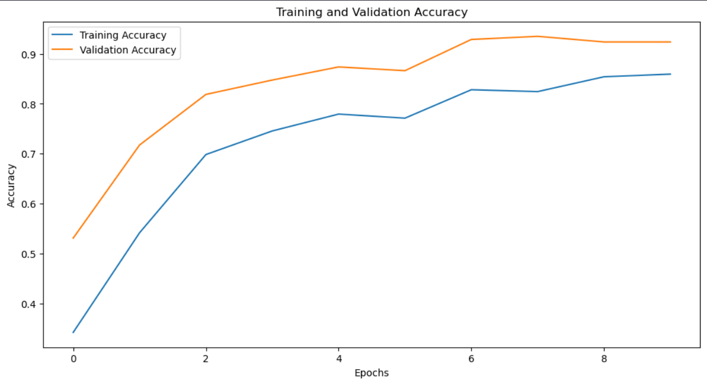
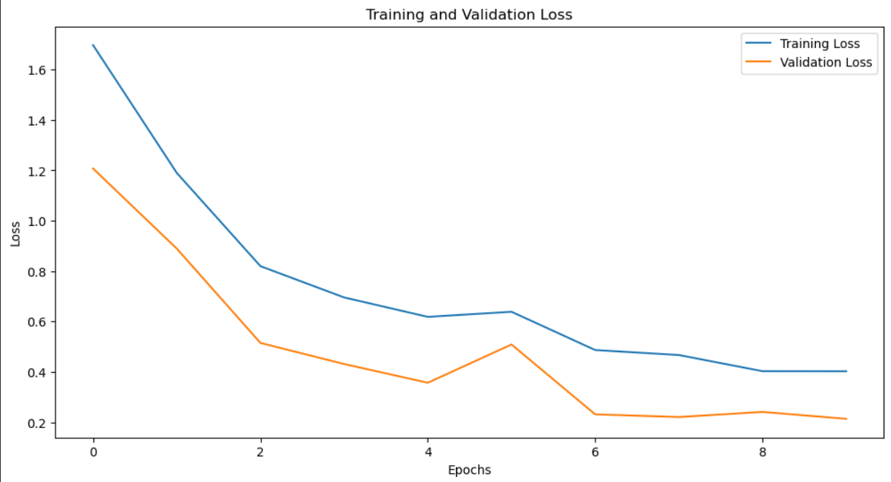
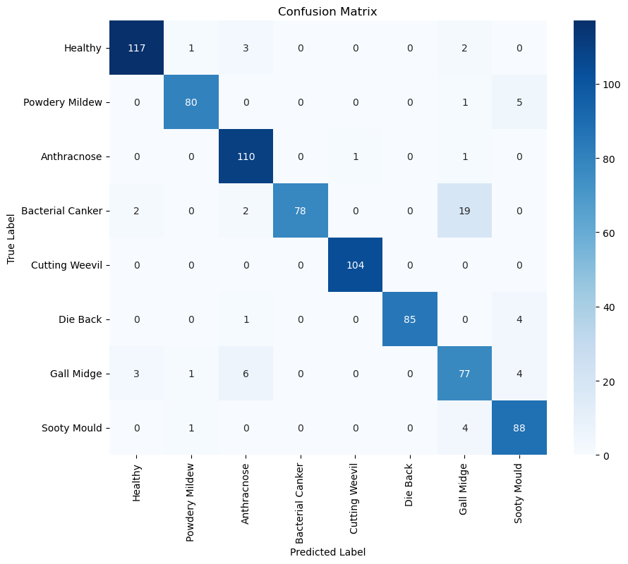
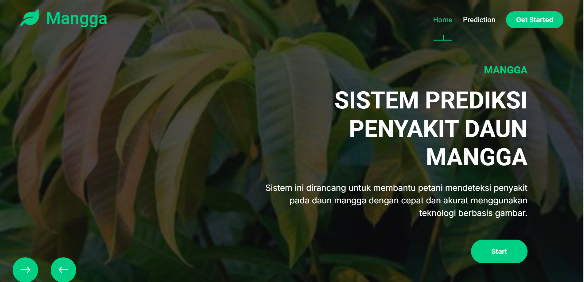
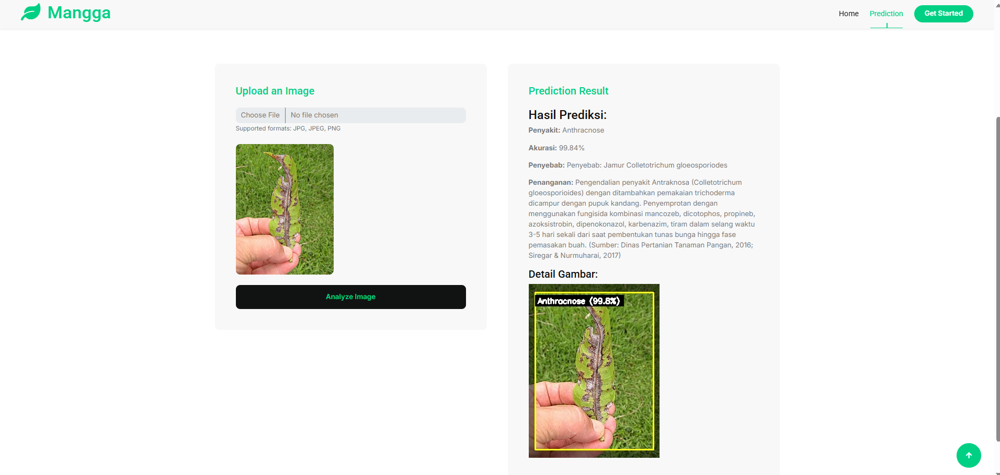

# Computer Vision Project Progress Report (100%)

## Project Name
**Pendeteksi Penyakit Daun Mangga**

## Student Name
**Brilian Purnama Putra**

## Course/Institution
**Computer Vision / Politeknik Caltex Riau**

---

## 📌 Latar Belakang
Di Indonesia, terdapat beragam jenis pohon yang tumbuh dengan ukuran yang bervariasi, salah satunya adalah pohon mangga (*Mangifera indica*). Meskipun mangga adalah tanaman tropis, saat ini telah banyak dibudidayakan di berbagai negara, termasuk Indonesia. Namun, berdasarkan data Badan Pusat Statistik (BPS), terjadi penurunan produksi mangga pada tahun 2023. Salah satu faktor penyebabnya adalah penyakit yang menyerang daun tanaman mangga.

Penyakit pada daun dapat disebabkan oleh berbagai faktor seperti serangga, suhu, bakteri, jamur, dan virus. Gejalanya berupa munculnya bercak pada daun, bunga, buah, dan batang, yang dapat menurunkan kualitas serta kuantitas produksi mangga. Oleh karena itu, diperlukan sistem identifikasi dini penyakit daun mangga secara otomatis dan akurat.

Proyek ini mengembangkan sistem klasifikasi penyakit daun mangga berbasis citra menggunakan metode **Convolutional Neural Network (CNN)**. Sistem ini telah berhasil diintegrasikan ke dalam aplikasi web yang mampu mendeteksi, mengklasifikasikan jenis penyakit, memberikan rekomendasi penanganan, dan menampilkan bounding box area terdampak dengan tingkat kepercayaan akurasi.

---

## 🔍 Peran Computer Vision dalam Proyek Ini
Ilmu **Computer Vision** diterapkan secara menyeluruh dalam proyek ini, mulai dari proses awal hingga prediksi akhir:

- **Akuisisi Citra**: Pengambilan gambar daun dari dataset atau unggahan pengguna.
- **Preprocessing Citra**: Resizing, normalisasi piksel, augmentasi gambar, dan konversi warna.
- **Ekstraksi Fitur Visual**: CNN mendeteksi fitur penting dari citra, seperti warna dan pola bercak.
- **Klasifikasi Citra**: Model mengklasifikasikan daun ke dalam kategori penyakit atau sehat.
- **Bounding Box & Visualisasi**: Area yang terdampak ditampilkan dalam bentuk bounding box warna kuning, dengan label jenis penyakit dan tingkat kepercayaan (*confidence*).
- **Saran Penanganan**: Sistem memberikan rekomendasi penanganan berdasarkan jenis penyakit.

---

## 🎯 Tujuan
- Mendeteksi dan mengklasifikasikan jenis penyakit daun mangga menggunakan CNN.
- Memberikan Akurasi (confidence) terhadap hasil klasifikasi.
- Menyediakan informasi penanganan berdasarkan klasifikasi penyakit.
- Menampilkan visual bounding box untuk mempermudah pengguna mengenali bagian daun yang terdampak.
- Mengimplementasikan sistem dalam aplikasi web yang mudah digunakan.

---

## ✅ Manfaat
- Membantu petani dan masyarakat dalam mendeteksi penyakit daun mangga secara cepat dan tepat.
- Memberikan solusi penanganan dini terhadap penyakit.
- Meningkatkan kualitas hasil panen dan mengurangi kerugian produksi.
- Menjadi referensi untuk pengembangan sistem klasifikasi citra penyakit tanaman lainnya.

---

## 🔒 Batasan Masalah
- Model hanya menggunakan arsitektur CNN sederhana (tanpa transfer learning).
- Dataset hanya berasal dari Kaggle.
- Sistem saat ini hanya memproses citra daun mangga dari gambar statis (bukan realtime kamera).

---

## 📁 Dataset
- Dataset: Mango Leaf Disease Dataset  
- Sumber: [Kaggle - Mango Leaf Disease Dataset](https://www.kaggle.com/datasets/aryashah2k/mango-leaf-disease-dataset)

---

## 🛠️ Tools & Teknologi
- **Bahasa Pemrograman:** Python  
- **Framework:** TensorFlow / Keras  
- **Metode:** CNN  
- **Visualisasi:** CV, Matplotlib  
- **Web Framework:** Flask  
- **Teknik:** Image preprocessing, feature extraction, classification, bounding box detection  

---

## 🚀 Fitur Sistem
1. **Upload Gambar:** Pengguna dapat mengunggah gambar daun mangga.
2. **Prediksi Penyakit:**
   - Jenis penyakit ditampilkan secara otomatis.
   - Menampilkan tingkat kepercayaan akurasi (*confidence score*).
3. **Visualisasi Bounding Box:**
   - Area daun ditandai dengan **bounding box berwarna kuning**.
   - Label jenis penyakit dan confidence ditampilkan di dalam gambar.
4. **Rekomendasi Penanganan:**
   - Misalnya: "Penyakit Jamur Antraknosa – Gunakan fungisida berbahan aktif tembaga."
5. **Antarmuka Web Sederhana:**
   - Menampilkan hasil klasifikasi, confidence, gambar asli + bounding box, dan penanganan.

---

## 📈 Detail Progress 
- ✅ Data preprocessing dan augmentasi gambar selesai.
- ✅ Model CNN dilatih dengan akurasi validasi hingga **92%**.
- ✅ Implementasi bounding box CV selesai.
- ✅ Sistem web berbasis Flask telah aktif dan menerima input gambar.
- ✅ Sistem memberikan output klasifikasi, confidence, penanganan, dan gambar hasil.
- ✅ Progres Proyek: **100% (Selesai)**

## 🚀 Hasil 
- ### Grafik akurasi dan loss model
  

  
  
  

- ### Confusion Matrix
  

  
  

- ### Aplikasi
  

  
  
  

